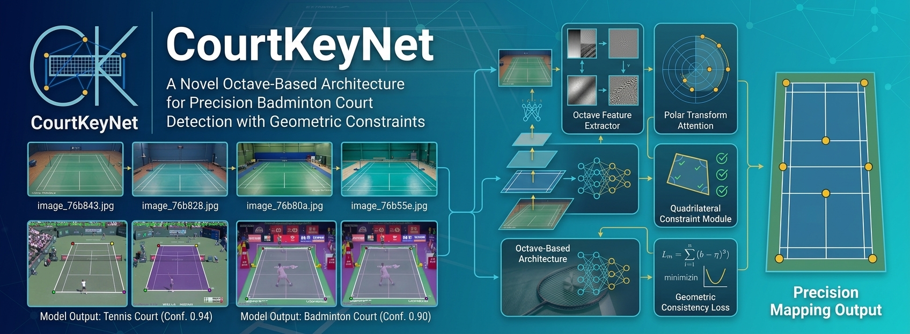
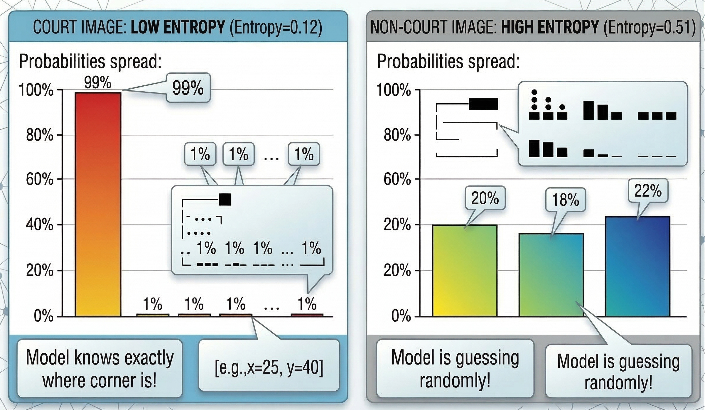

<div align="center">
  

<h1>CourtKeyNet : A Novel Octave-Based Architecture for Precision Court Detection</h1>

Adithya N Raj

</div>

<div align="center">

[](https://www.sciencedirect.com/science/article/pii/S2666827026000496)
[](https://huggingface.co/Cracked-ANJ/CourtKeyNet)
[](https://github.com/adithyanraj03/Paper_09_Data-Set_CourtKeyNet)
[](https://www.python.org/downloads/)
[](https://pytorch.org/)
[](https://wandb.ai/)
[](LICENSE)

</div>

-----

Excited to introduce **CourtKeyNet**, an open-sourced deep learning architecture stemming from sports video analysis. Positioned as a top-tier court detection model, CourtKeyNet offers the following features. 
- **High-Fidelity Feature Extraction**: It maintains high fidelity in capturing both fine court details and global structural context effortlessly using a novel Octave Feature Extractor. 
- **Robust Boundary Attention**: It enables precise boundary localization by mapping spatial relationships in polar coordinates via our Polar Transform Attention. 
- **Geometric Consistency & Open Access**: It supports structurally valid outputs, strictly ensuring proper quadrilateral properties through a dedicated Constraint Module and Geometric Consistency Loss. We provide public access to the code and pre-trained models. We believe our release will empower the community with practical applications across areas like sports video analysis, match statistics generation, and automated broadcasting systems.

## 🎬 Video Demo
<div align="center">
  
</div>


## Dataset

The datasets utilized for CourtKeyNet are located in the `datasets` folder, which is linked as a submodule to the primary dataset repository:
- [CourtKeyNet Dataset GitHub Repository](https://github.com/adithyanraj03/Paper_09_Data-Set_CourtKeyNet)

*Note: The dataset contains badminton court images for keypoint detection and main repository has the custom annotation tool for geometric keypoints labeling.*

## Installation & Setup

Set up a conda environment and install dependencies:

```bash
# 1. Clone the repository
git clone https://github.com/adithyanraj03/CourtKeyNet.git
cd CourtKeyNet

# 2. Create and activate a Conda environment
conda create -n courtkeynet python=3.10 -y
conda activate courtkeynet

# 3. Install requirements
pip install -r requirements.txt

# 4. Login to Weights & Biases (optional, for experiment tracking)
wandb login
```

### Model Download

| Model | Details | Resolution | Download Links |
| :---  | :--- | :--- | :--- |
| **CourtKeyNet-Base** | Full Architecture | Native | 🤗 [HuggingFace](https://huggingface.co/Cracked-ANJ/CourtKeyNet) |
| **CourtKeyNet-Fast** | Light Architecture | Native | *To be released* |

Download models using huggingface-cli:
```sh
pip install "huggingface_hub[cli]"
huggingface-cli download Cracked-ANJ/CourtKeyNet --local-dir ./courtkeynet-base
```

<details open>
<summary style="font-size: 1.4em; color: #4169e1; font-weight: bold; cursor: pointer;">Click to hide: How Confidence Detection Works (Visual Explanation)</summary>

# How Confidence Detection Works 

Model (`CourtKeyNet`) works like this:


**Problem**: It has no "court detector" - it assumes every image IS a court!

---

## What the Model Actually Outputs Internally

When you run `model(image)`, it returns a dictionary with these components:

```python
outputs = {
    'heatmaps': Tensor[B, 4, 160, 160],      # 4 gaussian peaks (one per corner)
    'kpts_init': Tensor[B, 4, 2],            # Initial keypoints from heatmaps
    'kpts_refined': Tensor[B, 4, 2],         # Final refined keypoints
    'features': Tensor[B, 256, 20, 20]       # Feature maps (optional)
}
```

### Visualization of Heatmap Output

For a **real court image**:
```text
Heatmap for Corner 0 (Top-Left):
```


For a **non-court image** (e.g., random person):
```text
Heatmap for Corner 0:
```


---

## 3 Confidence Metrics I Added

### 1️⃣ **Heatmap Peak Confidence** (Primary Signal)

**What it measures**: How "peaky" the heatmap is

```python
max_values = heatmaps.max(dim=(2,3))  # Find highest value in each heatmap
conf_heatmap = max_values.mean()      # Average across 4 corners
```

**Visual comparison**:


---

### 2️⃣ **Heatmap Entropy** (Uncertainty)

**What it measures**: How "spread out" the probability is

```python
# Entropy = -Σ(p * log(p))
# Low entropy = focused (good)
# High entropy = random noise (bad)
```

**Visual comparison**:



---

### 3️⃣ **Geometric Validity** (Shape Check)

**What it checks**: Does the quad look like a real court?

```text
Checklist:
✓ Are corners in correct positions? (TL upper-left, BR lower-right)
✓ Is the quad convex? (no crossed lines)
✓ Is the area reasonable? (not too tiny, not entire image)
✓ Is aspect ratio court-like? (not a thin line)
```

**Visual examples**:


---
</details>

## Repository Structure

```
CourtKeyNet/
├── courtkeynet/
│   ├── configs/
│   │   ├── courtkeynet.yaml     # Model hyperparameters
│   │   └── dataset.yaml         # Dataset configuration
│   ├── models/
│   │   ├── __init__.py
│   │   ├── courtkeynet.py       # Main architecture
│   │   ├── octave.py            # Octave Feature Extractor
│   │   ├── polar.py             # Polar Transform Attention
│   │   └── qcm.py               # Quadrilateral Constraint Module
│   ├── losses/
│   │   ├── __init__.py
│   │   └── geometric_loss.py    # Geometric Consistency Loss
│   ├── utils/
│   │   ├── __init__.py
│   │   ├── dataloader.py        # YOLO pose dataset loader
│   │   └── metrics.py           # Evaluation metrics
│   ├── train.py                 # Training script with wandb
│   ├── finetune.py              # Finetuning script
│   └── inference.py             # Inference/visualization
├── datasets/                    # Datasets (submodule)
├── requirements.txt
└── README.md
```

## Training

The training scripts are located within the `courtkeynet/` directory.

### Basic Training

```bash
cd courtkeynet
python train.py --data_root path/to/dataset
```

### With Custom Config

```bash
cd courtkeynet
python train.py \
    --data_root path/to/dataset \
    --cfg configs/courtkeynet.yaml \
    --data_cfg configs/dataset.yaml
```

### Resume Training

```bash
cd courtkeynet
python train.py \
    --data_root path/to/dataset \
    --resume runs/courtkeynet/exp/epoch_50.pt
```

## Inference

```bash
cd courtkeynet
python inference.py \
    --weights runs/courtkeynet/exp/best.pt \
    --source path/to/images \
    --output runs/predictions
```

## Architecture Details

### Octave Feature Extractor (Section 3.2)
Processes visual information at multiple frequency bands:
- **High-frequency path**: Fine court details using Court-Specific Shape Kernels
- **Mid-frequency path**: Structural patterns with Non-Local Self-Similarity
- **Low-frequency path**: Global context via Fourier Feature Encoder

### Polar Transform Attention (Section 3.3)
Enhances boundary detection by processing features in polar coordinates, naturally suited for detecting court boundaries radiating from the center.

### Geometric Consistency Loss (Section 3.6)
Combined loss function:
```
L_total = λ_kpt·L_kpt + λ_hm·L_hm + λ_edge·L_edge + λ_diag·L_diag + λ_angle·L_angle
```

## Expected Training Time

| GPU | Batch Size | Time/Epoch | Total (120 epochs) |
|-----|------------|------------|-------------------|
| RTX 5090 | 32 | ~8 min | ~16 hours |
| RTX 4090 | 24 | ~12 min | ~24 hours |
| RTX 3090 | 16 | ~18 min | ~36 hours |

## Citation

If you use CourtKeyNet in your research, please cite:

Paper Link: **[CourtKeyNet: A novel octave-based architecture for precision badminton court detection with geometric constraints](https://www.sciencedirect.com/science/article/pii/S2666827026000496)**  
DOI: [https://doi.org/10.1016/j.mlwa.2026.100884](https://doi.org/10.1016/j.mlwa.2026.100884)

```bibtex
@article{NRAJ2026100884,
title = {CourtKeyNet: A novel octave-based architecture for precision badminton court detection with geometric constraints},
journal = {Machine Learning with Applications},
volume = {24},
pages = {100884},
year = {2026},
issn = {2666-8270},
doi = {https://doi.org/10.1016/j.mlwa.2026.100884},
url = {https://www.sciencedirect.com/science/article/pii/S2666827026000496},
author = {Adithya N Raj and Prethija G.}
}
```

## License

This project is released under the [MIT License](LICENSE), suitable for both academic and commercial use.

## Contact

For questions or collaboration opportunities, please contact at adithyanraj03@gmail.com
